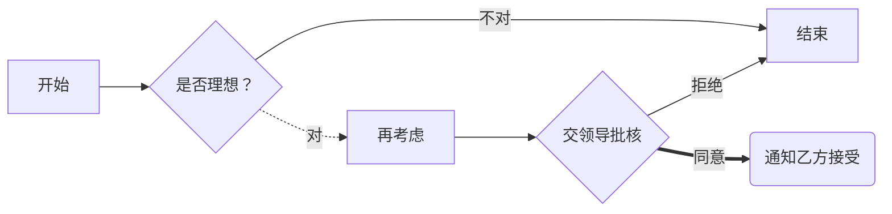

> **what's pp**
> 
*阿爸阿aa*

分发给  


-----


[baidu](www.baidu.com)

[风景](http://www.baidu.com)


<u>下划线测试uu美好</u>

`hello world` is a good program

```bash
include<i eat it>
waht's you name
fuck you
```

>|项目|价格|数量|总价|
>|----|----|----|----|
>|计算机|3000|5|15000|
>|手机|5000|10|50000|
>|笔记本|4000|20|80000|


适用markdown[^1]可以有效的书写文本。直接转换成HTML[^2],这样你可以使用Typora[^3]编辑器进行书写

[^1]:markdown是一种纯文本标记语言
[^2]: huypertext markdown
[^3]: affngagf


$$e=mc^2$$


$f=ma$

$$e=mc^2$$

# 计划
##  第一步
### - 找人
### - 干活
## 第二步


faer
fafag




欢迎来到[冰雪世界](http://alist.xiaoya.pro "小雅的网盘")


